| Image | Thing |
|-- |-- |
|  | Absorption |
|  | Bad Omen |
|  | Breed Chicken |
|  | Breed Cow |
|  | Breed Hoglin |
|  | Breed Horse |
| 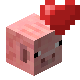 | Breed Pig |
| 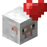 | Breed Sheep |
| 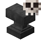 | Die to Anvil |
|  | Die to Bee |
| 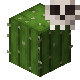 | Die to Cactus |
| 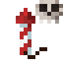 | Die to Firework |
|  | Die to Llama |
| 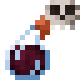 | Die to Magic |
|  | Die to Sweet Berries |
| 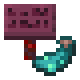 | Use glow ink on a crimson sign |
| 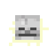 | Glowing |
|  | Height Limit |
|  | Jump Boost |
|  | Kill Ghast |
|  | Kill Guardian |
| 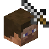 | Kill Player |
| 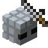 | Kill Silverfish |
|  | Kill Snow Golem |
|  | Kill Stray |
|  | Kill Stray Cycle |
|  | Kill Witch |
|  | Kill Zoglin |
| 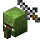 | Kill Zombie Villager |
|  | Reach Level 15 |
| 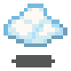 | Levitation |
| 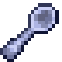 | Mining Fatigue |
| 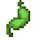 | Nausea |
| 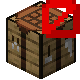 | No Crafting Table |
|  | No Death |
|  | No Fall Damage |
|  | No Fire |
| 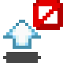 | No Jump |
| 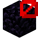 | No Obsidian |
|  | No Seeds |
|  | No Water |
| 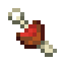 | Starve |
| 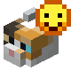 | Tame Cat |
|  | Tame Horse |
|  | Tame Parrot |
|  | Tame Wolf |
| 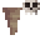 | Die to Falling Stalactite |
|  | 15 Advancements |
| 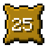 | 25 Advancements |
| 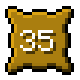 | 35 Advancements |
|  | 3 Status Effects |
| 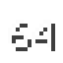 | 64 Of Anything |
| 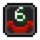 | 6 Status Effects |
| 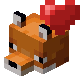 | Breed Fox |
|  | Breed Goat |
| 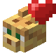 | Breed Ocelot |
|  | Breed Rabbit |
|  | Breed Strider |
|  | Breed X |
|  | Deal 400 Damage |
| 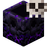 | Die To Anchor |
| 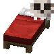 | Die To Bed |
|  | Die To Golem |
| 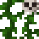 | Die To Vines |
| 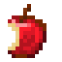 | Eat X Unique |
|  | Enrage Zombie Piglin |
|  | Kill 100 Mobs |
| 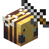 | Kill Bee Cycle |
|  | Kill Blue Sheep |
| 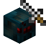 | Kill Cave Spider Cycle |
|  | Kill Cyan Sheep |
|  | Kill Drowned |
| 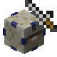 | Kill Elder Guardian |
|  | Kill Endermite |
|  | Kill Endermite Cycle |
| 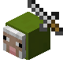 | Kill Green Sheep |
|  | Kill Husk |
|  | Kill Light Blue Sheep |
|  | Kill Lime Sheep |
|  | Kill Magenta Sheep |
|  | Kill Orange Sheep |
| 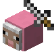 | Kill Pink Sheep |
| 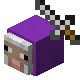 | Kill Purple Sheep |
| 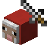 | Kill Red Sheep |
|  | Kill Silverfish Cycle |
|  | Kill Spider Cycle |
|  | Kill Wither Skeleton |
|  | Kill X Unique |
|  | Kill Yellow Sheep |
| 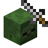 | Kill Zombie |
|  | Level 30 |
|  | More Hoopers |
|  | More Kelp |
| 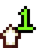 | More Level |
|  | Opponent Hits You |
|  | Opponent Takes 100 Damage |
| 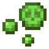 | Poison |
| 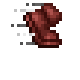 | Sprint 1Km |
|  | Take 200 Damage |
|  | Use Cauldron |
| 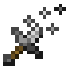 | Weakness |
|  | Nether Portal |
